# A Pipeline Of Pretraining Bert On Google TPU

A tutorial of pertaining Bert on your own dataset using google TPU

## Introduction

Bert, which is also known as the Bidirectional Encoder Representations from Transformers, is a powerful neural network model presented by Google in 2018. There exist a bunch of pre-trained models that can be fine-tuned for the downstream tasks to achieve good performances. Though the pre-trained model is good enough, you may still want to tune the pre-trained model offered by Google on your own domain-specific corpus for several additional epochs. That is, give your Bert model a chance to be familiar with the your jargons. Then we can expect better performance in the end.

Nevertheless, as I observed, such a tuning (pretraining) process is really time-consuming even on a 1080Ti GPU. The batch size is limited, and the loss decreases slowly. One promising way to solve this problem is to use TPU, which is provided in the Google Cloud Platform. From my personal experience, a V_3.8 TPU is 20~30 times faster than a 1080Ti GPU (no joking!). So, in this tutorial, We will go over the pipeline of pretraining the Bert on TPU. 

## Pre-request
1. A Google account
2. A bank card (No worry! Google won't charge you any fees! At least this time :P)
3. Your data

## Data preparation
Prepare your data as you are told at [the Bert repo](https://github.com/google-research/bert#pre-training-with-bert). After this process, you should get a .txt file. This time, let's simply use the sample_text.txt, which can be downloaded from [the Bert repo](https://github.com/google-research/bert.git). 

Download the pre-trained Bert model at [here](https://storage.googleapis.com/bert_models/2018_11_23/multi_cased_L-12_H-768_A-12.zip), make sure you unzip it. Now you get a folder named "multi_cased_L-12_H-768_A-12".

## Data upload
First, go to the [Google cloud platform](https://cloud.google.com) and sign in. Create your project, and you should see this interface:

<p>
    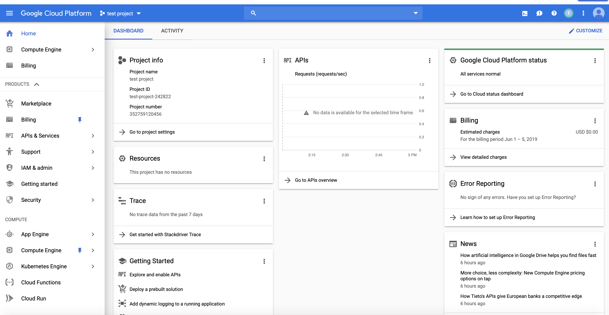
</p>

Then, click the storage button on the left bar:

<p>
    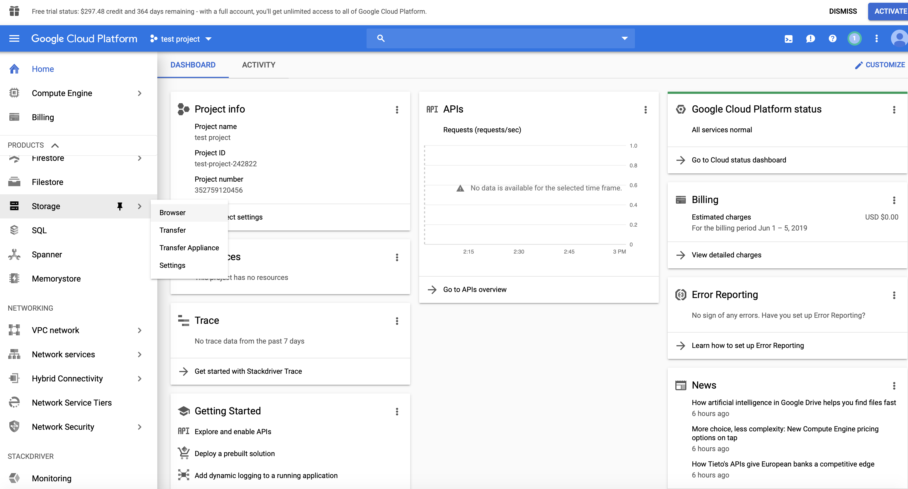
</p>

Click Create bucket, then give it a name. For example the "sample_bucket_test". Make sure that this name is not used by any other people.

<p>
    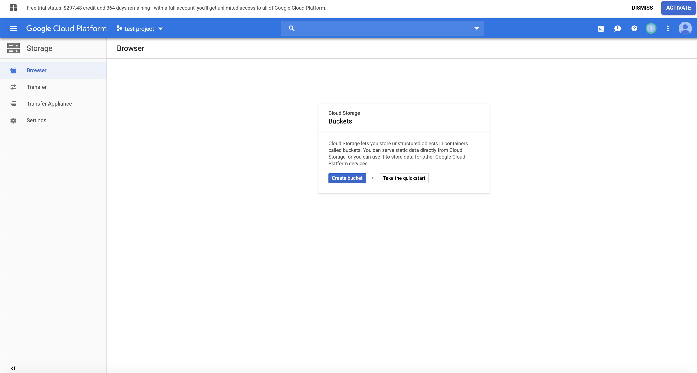
</p>

<p>
    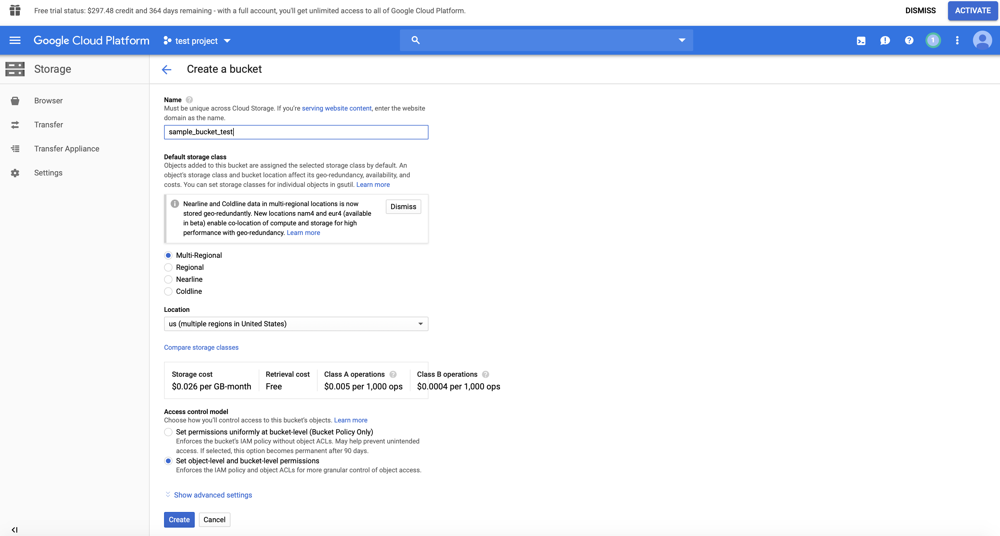
</p>

Ok! Now it's time to upload the data (sample_text.txt) and the pre-trained model from Google (multi_cased_L-12_H-768_A-12) to the bucket!

<p>
    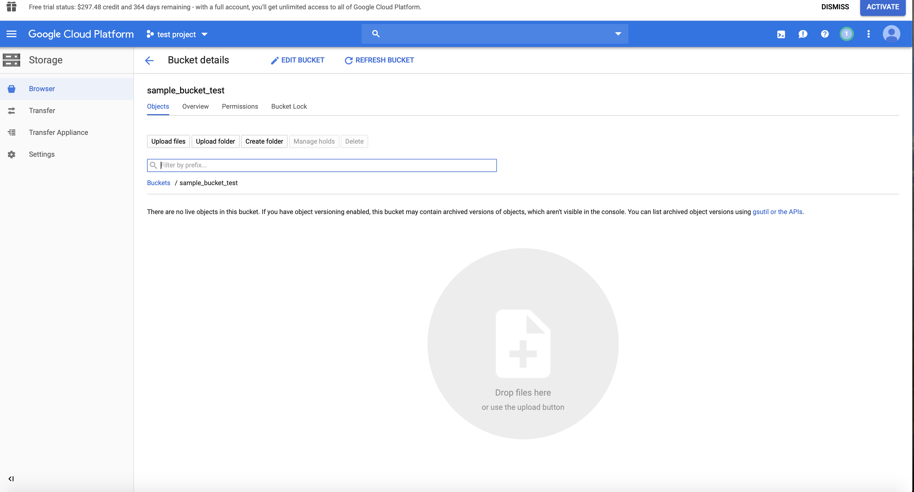
</p>

Click the Upload folder button, and select the folder "multi_cased_L-12_H-768_A-12" to upload the pre-trained model. Click the Upload files button, and select the file "sample_text.txt" to upload your data. Then you should get something like this:

<p>
    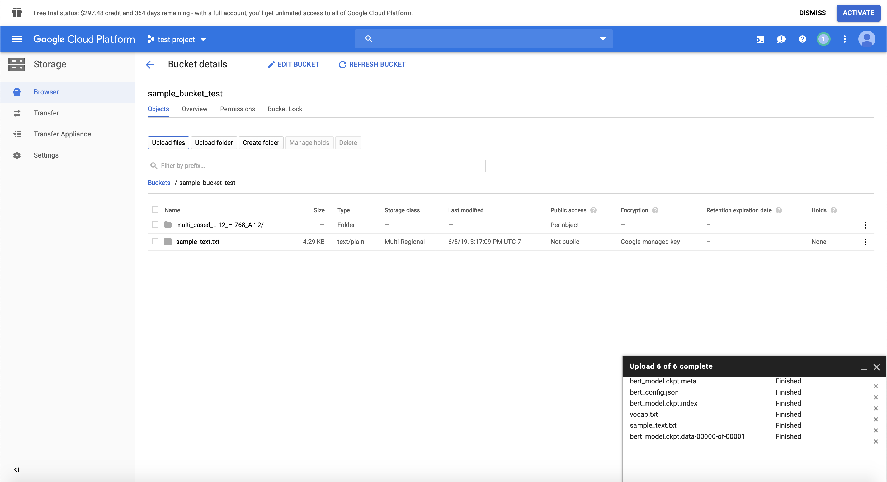
</p>

## Create a VM & TPU
Click the button on the right top to activate the cloud shell:

<p>
    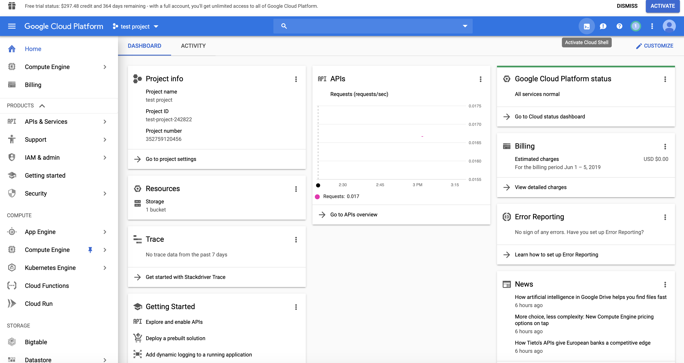
</p>

Here is something you should see:

<p>
    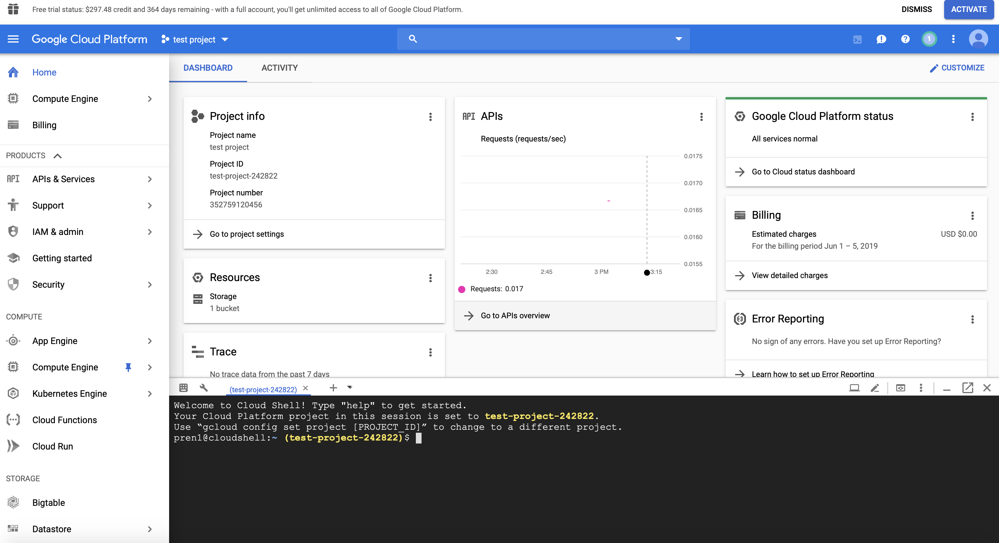
</p>

Then, it's time to start the VM (Virtual Machine) & TPU now! simply run the following code. You can decide your TPU name by yourself. But make sure you remember it -- we are going to use it later:

```
ctup up --name=test_tpu
```

However, if you want to use the newest TPU, you should tell Google about this (Google! Give me your best V3-8 TPU!). But wait, the new GPU is more expensive (8.00$/hour). That's why I added "--preemptible" in the following command. Basically, by adding this, Google can stop your training process whenever it wants. Nevertheless, it's much cheap: 2.40$/hour. This should not be a problem if your program saves your model frequently or if you are super lucky. 

```
ctpu up --name=test-tpu --tpu-size=v3-8 --preemptible  
```

<p>
    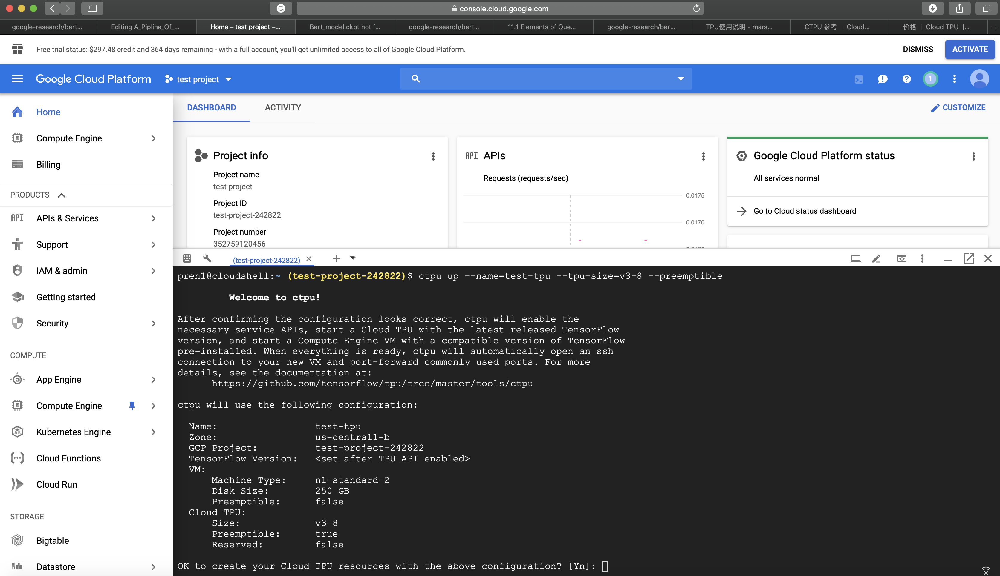
</p>

Press "y" and "Enter" to continue. It may take a while, so just wait. By the way, if you are asked to set a password about ssh, just set it. 

<p>
    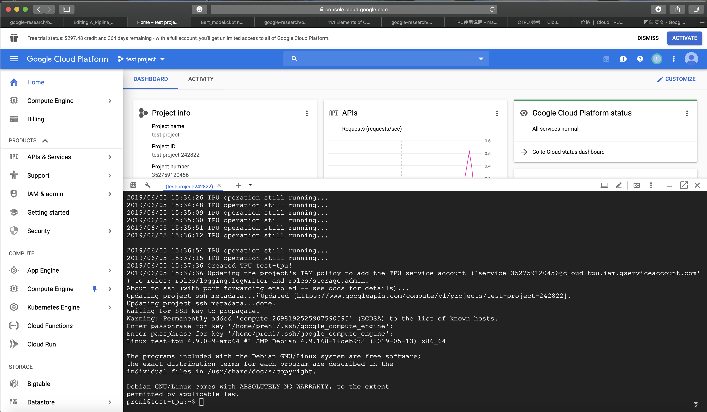
</p>

Now, you can run the following command to check the status of your VM and TPU:

```
ctpu status
```

Here is something I got:

<p>
    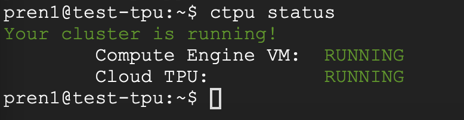
</p>

## Fetch Bert program
Previously, we have downloaded a pretrained model. Since we would like to train the model for additional epochs, we need to get the tensorflow code. Simply run:

```
git clone https://github.com/google-research/bert.git
```

You should see a folder named Bert under your current directory:

<p>
    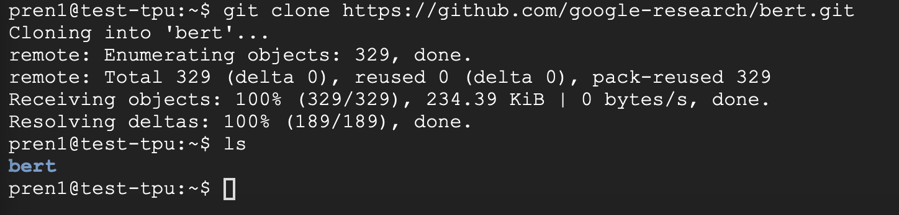
</p>

We are almost there! Enter the folder "Bert", and run the following code to process the data. A file named tf_examples.tfrecord can be found under the "tmp" folder:

```
python create_pretraining_data.py \
  --input_file=gs://sample_bucket_test/sample_text.txt \
  --output_file=gs://sample_bucket_test/tmp/tf_examples.tfrecord \
  --vocab_file=gs://sample_bucket_test/multi_cased_L-12_H-768_A-12/vocab.txt \
  --do_lower_case=True \
  --max_seq_length=128 \
  --max_predictions_per_seq=20 \
  --masked_lm_prob=0.15 \
  --random_seed=12345 \
  --dupe_factor=5
```
Just like this:

<p>
    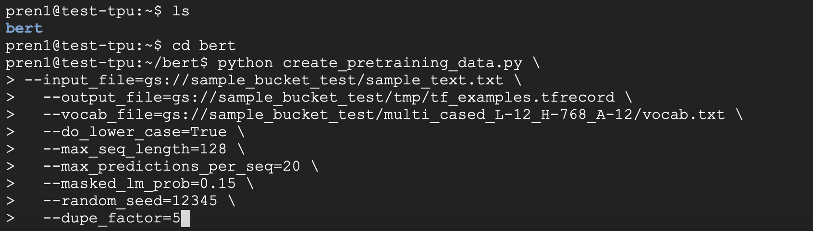
</p>

Please, notice the usage of "gs://". It connects the google storage buckets with your virtual machine. I think this is actually the most valuable part of this tutorial... Anyway, the process should finish really quickly:

<p>
    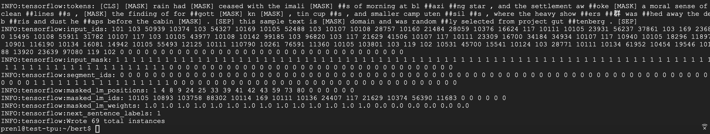
</p>

Now, it's time to train the model! Run the following code. Notice that the tpu_name is set to the name you gave to the TPU previously:

```
  python run_pretraining.py \
  --input_file=gs://sample_bucket_test/tmp/tf_examples.tfrecord \
  --output_dir=gs://sample_bucket_test/tmp/pretraining_output \
  --do_train=True \
  --do_eval=True \
  --bert_config_file=gs://sample_bucket_test/multi_cased_L-12_H-768_A-12/bert_config.json \
  --init_checkpoint=gs://sample_bucket_test/multi_cased_L-12_H-768_A-12/bert_model.ckpt \
  --train_batch_size=32 \
  --max_seq_length=128 \
  --max_predictions_per_seq=20 \
  --num_train_steps=20 \
  --num_warmup_steps=10 \
  --learning_rate=2e-5 \
  --use_tpu=True \
  --tpu_name=test-tpu
```
Like this:

<p>
    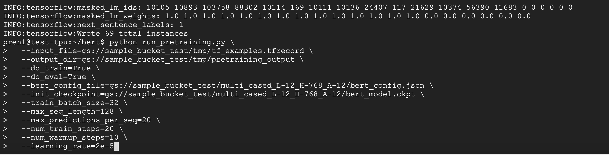
</p>

After a while, you can see the following result:

<p>
    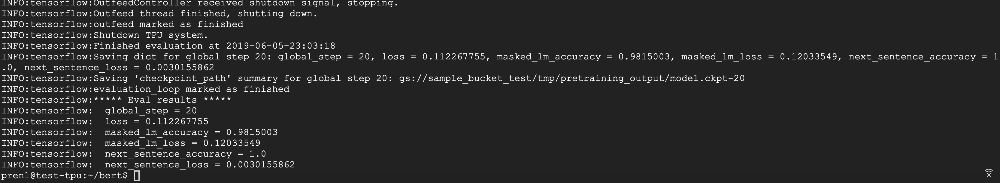
</p>

🎉 Bravo! You did it! 🎉

## battlefield cleanup
Run: 
```
exit
```
To log out the VM

Run:
```
ctpu delete --name=test-tpu
```
To delete your TPU

After that, run
```
ctpu status
```
To make sure that you have stopped the VM and the TPU. You should see something like this:

<p>
    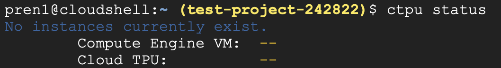
</p>

Finally, run:

```
gsutil rm -r gs://sample_bucket_test
```

To clean up the google storage bucket. Make sure you replace "sample_bucket_test" with your own bucket name.

Done!
